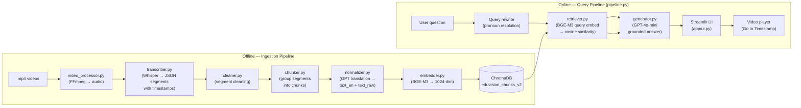

# EduVision RAG — Video Teaching Assistant

> Ask natural-language questions about video course material and get grounded answers with exact timestamps — then jump directly to the right moment in the video.

---

## Key Features

| Feature | Description |
|---|---|
| 🎙️ **Multilingual transcription** | OpenAI Whisper extracts word-level timestamps from lecture videos, with `translate` mode for non-English segments |
| 🌐 **English normalization** | GPT-4o-mini translates non-English transcript chunks to English; raw text is preserved separately for provenance |
| 🔍 **Semantic retrieval** | BGE-M3 encodes queries and chunks into 1024-dim vectors; ChromaDB finds the most relevant evidence |
| 📌 **Grounded answers** | GPT-4o-mini answers exclusively from retrieved transcript evidence — every fact is cited with a `[Video: "..." @ timestamp]` reference |
| ⏱️ **Go to Timestamp** | Clicking a source card seeks the local video player to the exact timestamp of the retrieved chunk |
| 💬 **Conversation context** | Conversation history is passed to the generator so follow-up questions read naturally |
| 🔄 **Contextual retrieval** | Ambiguous follow-ups (e.g. "why is it important?") are rewritten into self-contained queries (e.g. "why is HTML important?") before retrieval |
| 🛡️ **Confidence guardrails** | Chunks below the similarity threshold are flagged and shown separately; the LLM refuses to answer when evidence is insufficient |

---

## Architecture



---

## Project Structure

```
EduVision RAG/
├── app/
│   ├── ui.py                  ← Streamlit web UI (entry point)
│   └── .streamlit/
│       └── config.toml        ← Streamlit theme config
├── config/
│   └── settings.py            ← All configuration (loaded from .env)
├── data/
│   ├── transcripts/           ← Raw Whisper JSON outputs (gitignored)
│   ├── processed/             ← Cleaned chunks + normalizer cache (gitignored)
│   └── vector_db/             ← ChromaDB persistence directory (gitignored)
├── eval/
│   └── evaluate.py            ← 17-question evaluation suite (single-turn)
├── generation/
│   └── generator.py           ← Stage 9: GPT-4o-mini grounded answer generation
├── ingestion/
│   ├── video_processor.py     ← Stage 2: FFmpeg audio extraction
│   ├── transcriber.py         ← Stage 3: Whisper transcription
│   ├── cleaner.py             ← Stage 4: Transcript cleaning
│   ├── chunker.py             ← Stage 5: Segment grouping into retrieval chunks
│   ├── embedder.py            ← Stage 6: BGE-M3 embedding generation
│   ├── indexer.py             ← Stage 7: ChromaDB indexing (v1)
│   ├── indexer_v2.py          ← Stage 7b: ChromaDB indexing (v2, English-normalized)
│   └── normalizer.py          ← Stage 14: GPT translation + English normalization
├── retrieval/
│   └── retriever.py           ← Stage 8: BGE-M3 semantic retrieval
├── videos/                    ← Place .mp4 files here (gitignored)
├── pipeline.py                ← Stage 10: End-to-end orchestrator (ask / search / health_check)
├── requirements.txt
├── setup.py
├── .env                       ← Secrets (never commit)
└── .gitignore
```

---

## Quick Start

### Prerequisites

- Python 3.10+
- [FFmpeg](https://ffmpeg.org/download.html) installed as a system binary:
  ```bash
  # macOS
  brew install ffmpeg

  # Ubuntu / Debian
  sudo apt install ffmpeg
  ```

### 1. Clone and enter the project

```bash
git clone <repo-url>
cd "EduVision RAG"
```

### 2. Create and activate a virtual environment

```bash
python3 -m venv venv
source venv/bin/activate      # macOS / Linux
# venv\Scripts\activate       # Windows
```

### 3. Install dependencies

```bash
pip install -r requirements.txt
```

> **Note:** `torch` (~2 GB) and `FlagEmbedding` (BGE-M3, ~570 MB) are large downloads.
> The BGE-M3 model is cached by HuggingFace after the first download.

### 4. Configure secrets

Create a `.env` file at the project root:

```env
OPENAI_API_KEY=sk-...          # Required for answer generation
```

All other settings have working defaults (see [Environment Variables](#environment-variables)).

### 5. Add your videos

Place `.mp4` lecture videos inside the `videos/` directory.

### 6. Run the ingestion pipeline

```bash
# Transcribe, chunk, normalize, and index all videos in videos/
python ingestion/indexer_v2.py
```

Already-processed videos are skipped automatically.

### 7. Launch the UI

```bash
streamlit run app/ui.py
```

Open [http://localhost:8501](http://localhost:8501) in your browser.

---

## How It Works

### Offline Ingestion

1. **FFmpeg** extracts audio from each `.mp4` file
2. **Whisper** transcribes audio to JSON with word-level timestamps; `translate` task mode is used for non-English segments
3. **Chunker** groups consecutive Whisper segments into overlapping retrieval chunks (5 segments per chunk, 1 segment overlap)
4. **Normalizer** uses GPT-4o-mini to translate non-English chunks to English (`text_en`); raw text is preserved as `text_raw` for provenance
5. **BGE-M3** embeds each chunk's `text_en` into a 1024-dimensional vector
6. **ChromaDB** persists embeddings and metadata (video filename, start/end timestamps, similarity score)

### Online Query (per user question)

1. **Query rewriting** — if the question contains pronouns or references to prior context (e.g. "why is it important?"), a lightweight GPT call rewrites it to a self-contained form (e.g. "why is HTML important?") for retrieval only
2. **Retrieval** — BGE-M3 encodes the retrieval query; ChromaDB returns the top-10 most similar chunks by cosine similarity
3. **Evidence filtering** — chunks below the 0.50 similarity threshold are excluded from the LLM prompt
4. **Generation** — GPT-4o-mini receives the original question, prior conversation context, and up to 5 above-threshold chunks; it answers exclusively from this evidence with `[Video: "..." @ MM:SS]` citations
5. **UI rendering** — Streamlit displays the answer, source cards with timestamps, and a video player that seeks to the cited moment when clicked

---

## Environment Variables

| Variable | Default | Description |
|---|---|---|
| `OPENAI_API_KEY` | — | **Required.** Your OpenAI API key |
| `OPENAI_MODEL` | `gpt-4o-mini` | OpenAI model for answer generation and normalization |
| `WHISPER_MODEL` | `base` | Whisper model size (`tiny` · `base` · `small` · `medium` · `large-v3`) |
| `BGE_MODEL` | `BAAI/bge-m3` | HuggingFace model ID for embeddings |
| `CHROMA_DB_PATH` | `data/vector_db` | ChromaDB persistence directory |
| `RETRIEVAL_TOP_K` | `10` | Number of candidate chunks retrieved per query |
| `MAX_LLM_EVIDENCE` | `5` | Maximum above-threshold chunks passed to the LLM |
| `SIMILARITY_THRESHOLD` | `0.50` | Minimum cosine similarity for evidence to be used |
| `MAX_TOKENS` | `1024` | Max tokens in LLM response |
| `TEMPERATURE` | `0.2` | LLM temperature (lower = more factual) |

---

## Technology Choices

| Component | Technology | Reason |
|---|---|---|
| Transcription | OpenAI Whisper | Word-level timestamps; `translate` mode for multilingual content |
| Embeddings | BGE-M3 (BAAI) | Strong multilingual semantic retrieval; free to run locally |
| Vector DB | ChromaDB | Persistent, embeddable, no external server needed |
| LLM | GPT-4o-mini | Fast, cost-efficient, strong instruction following |
| Frontend | Streamlit | Python-native UI; no JavaScript required |
| Video processing | FFmpeg | Industry standard; handles all codec/format edge cases |

---

## Design Principles

1. **Timestamps from metadata, never the LLM** — the model cannot hallucinate timestamps; they always come from Whisper segment metadata
2. **Two text fields per chunk** — `text_en` (English, always displayed) and `text_raw` (original language, kept for provenance only)
3. **Retrieval-grounded generation** — the LLM is instructed to answer exclusively from the retrieved evidence; it refuses when evidence is insufficient
4. **Contextual follow-up without hallucination** — follow-up queries are rewritten for retrieval; the prior assistant answer is passed as explicit context so the model can reference it with original citations, not invented ones
5. **Modular pipeline** — each stage is an independent Python module; `pipeline.py` is the single entry point for the UI

---

## Evaluation

The project includes a 17-question evaluation suite in `eval/evaluate.py` covering:

| Category | Description | Count |
|---|---|---|
| **WHERE** | "Where is X taught?" → correct video + timestamp | 3 |
| **WHAT** | Conceptual questions → grounded explanation | 3 |
| **HOW** | Procedural questions → correct steps + video citation | 3 |
| **SCOPE** | Topics inside corpus but non-obvious | 2 |
| **OUT-OF-SCOPE** | Topics not in corpus → must refuse without hallucinating | 3 |
| **EDGE** | Empty, too-short, or nonsense queries → graceful rejection | 3 |

**Current result: 17/17 PASS** on the 2-video corpus (Tutorial #1 and Tutorial #2).

---

## Current Scope & Limitations

- **Local videos only** — the Go to Timestamp player requires `.mp4` files in the `videos/` directory; YouTube URLs are not supported
- **2-video corpus** — the current index covers Tutorial #1 (Installing VS Code) and Tutorial #2 (Your First HTML Website); adding more videos requires re-running ingestion
- **English output** — all answers are generated in English; source cards display `text_en` regardless of the original video language
- **OpenAI dependency** — answer generation and English normalization require an OpenAI API key; retrieval (Search tab) works without one

---

## Development Stages

| Stage | Description | Status |
|---|---|---|
| 1 | Project setup & environment | ✅ |
| 2 | FFmpeg video → audio extraction | ✅ |
| 3 | Whisper transcription with timestamps | ✅ |
| 4 | Transcript cleaning & segmentation | ✅ |
| 5 | Chunking strategy (overlapping segments) | ✅ |
| 6 | BGE-M3 embedding generation | ✅ |
| 7 | ChromaDB persistent index (v1 + v2) | ✅ |
| 8 | Semantic retrieval with similarity threshold | ✅ |
| 9 | GPT-4o-mini grounded answer generation | ✅ |
| 10 | End-to-end pipeline orchestrator | ✅ |
| 11 | Confidence guardrails (not-found detection) | ✅ |
| 12 | Streamlit UI (chat + search tabs) | ✅ |
| 13 | Go to Timestamp video playback | ✅ |
| 14 | English normalization (text_en / text_raw) | ✅ |
| 15 | Multilingual ingestion (Whisper translate mode) | ✅ |
| 16 | Conversation history + contextual follow-up retrieval | ✅ |
