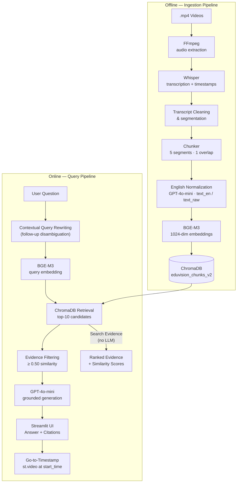

# EduVision RAG — Video Teaching Assistant

> Ask natural-language questions about video course material and receive grounded answers with exact transcript evidence — then jump directly to the cited moment in the video.

EduVision RAG is a production-quality retrieval-augmented generation pipeline built around lecture videos. It provides two independently usable retrieval experiences: a conversational Q&A interface backed by GPT-4o-mini, and a retrieval transparency tool that exposes ranked transcript evidence without LLM involvement. Every answer cites the exact video timestamp it came from.

---

## Key Features

| Feature | Description |
|---|---|
| **Ask a Question** | Conversational RAG — GPT-4o-mini answers exclusively from retrieved transcript evidence with `[Video @ MM:SS]` citations |
| **Search Evidence** | Retrieval-only inspection tool — surfaces ranked transcript chunks with similarity scores, no LLM generation |
| **Go-to-Timestamp** | Clicking any source card seeks the local video player to the exact start time of the retrieved chunk |
| **Contextual Follow-ups** | Ambiguous follow-ups (e.g. "why is it important?") are rewritten into self-contained retrieval queries before embedding |
| **Grounded Generation** | The LLM is constrained to answer only from retrieved evidence; refuses when evidence is insufficient |
| **Retrieval Transparency** | Similarity scores and threshold grouping are shown for every result in both tabs |
| **English Normalization** | Non-English transcript chunks are translated to English by GPT-4o-mini; `text_raw` is preserved for provenance |
| **Confidence Guardrails** | Below-threshold chunks are surfaced separately and excluded from generation; not-found state is handled explicitly |
| **Dynamic Video Catalogue** | Video filter and corpus stats are derived from ChromaDB metadata at runtime — no hardcoded lists |

---

## Why EduVision RAG?

Traditional RAG systems produce an answer and a list of text snippets. EduVision connects retrieval directly back to the original course material:

```
User Question
  → Contextual Query Rewriting       (pronoun/context disambiguation)
  → BGE-M3 Query Embedding           (1024-dimensional dense vector)
  → ChromaDB Retrieval               (top-10 candidates by cosine similarity)
  → Similarity Threshold Filtering   (0.50 cutoff)
  → GPT-4o-mini Grounded Generation  (answers from evidence only)
  → Answer + [Video @ MM:SS] Citations
  → Go-to-Timestamp playback         (st.video at exact start_time)
```

The key differentiator: every fact in the answer links back to the precise second in the original video where it was taught. A viewer can read the answer, inspect the raw transcript evidence, and immediately watch the relevant portion of the lecture — without searching the video manually.

---

## Two Retrieval Experiences

### 💬 Ask a Question

The primary RAG interface. The full pipeline runs end-to-end:

```
User Question
  → Contextual Query Rewriting
  → BGE-M3 Query Embedding
  → ChromaDB Retrieval (top-10)
  → Evidence Filtering (≥ 0.50 similarity)
  → GPT-4o-mini Grounded Generation (up to 5 evidence chunks)
  → Answer + Citations + Timestamp Source Cards
```

Follow-up questions are supported. When a question contains pronouns or references to a previous answer (e.g. "how does it work?"), a lightweight GPT call rewrites it into a self-contained form for retrieval (e.g. "how does HTML work?"). The prior assistant answer is passed as explicit context to the generator.

### 🔍 Search Evidence

A retrieval transparency tool. **No LLM answer is generated.**

```
Search Query
  → BGE-M3 Query Embedding
  → ChromaDB Retrieval (top-10)
  → Similarity Ranking
  → Threshold Grouping (above / below 0.50)
  → Ranked Transcript Chunks + Similarity Scores + Timestamps
```

Search Evidence allows the retrieval layer to be inspected independently from generation. It shows exactly which chunks the retrieval system would have returned for a query, with their raw similarity scores — useful for verifying corpus coverage, debugging retrieval quality, and demonstrating the system's factual grounding without making an LLM call.

---

## Architecture



---

## Corpus & Indexing

| Metric | Value |
|---|---|
| Course videos | 18 |
| Whisper segments processed | — |
| Embeddings generated | 1,528 |
| Chunks indexed | 1,510 |
| Low-quality chunks excluded | 18 |
| Videos represented in index | 18 / 18 |
| ChromaDB collection | `eduvision_chunks_v2` |
| Embedding dimensions | 1,024 |

Each chunk in ChromaDB retains full metadata: `video_filename`, `start_time`, `end_time`, `start_time_fmt`, `end_time_fmt`, `chunk_id`, `text_en`, and `text_raw`. Timestamp metadata originates from Whisper word-level alignment — it is never generated or approximated by the LLM.

---

## Retrieval & Generation Pipeline

**Ingestion (offline)**

1. **FFmpeg** — extracts audio from each `.mp4` lecture video
2. **Whisper** — transcribes audio to word-level timestamped JSON segments; `translate` task mode produces English for non-English speech
3. **Transcript Cleaning** — filters noise, handles segment boundaries
4. **Chunking** — groups 5 consecutive Whisper segments per chunk with 1-segment overlap for continuity
5. **English Normalization** — GPT-4o-mini translates non-English chunks to English (`text_en`); original text is preserved as `text_raw`
6. **BGE-M3 Embedding** — encodes `text_en` into a 1,024-dimensional dense vector
7. **ChromaDB** — persists vectors and metadata; already-indexed videos are skipped on re-run

**Query (online)**

8. **Contextual Query Rewriting** — if the question references prior context, a lightweight GPT call produces a self-contained retrieval query
9. **BGE-M3 Query Embedding** — the retrieval query is encoded with the same model
10. **ChromaDB Retrieval** — top-10 candidates returned by cosine similarity
11. **Similarity Threshold Filtering** — chunks below 0.50 are excluded from generation (still shown in Search Evidence)
12. **GPT-4o-mini Generation** — receives the original question, prior conversation turns, and up to 5 above-threshold chunks; instructed to answer exclusively from evidence with `[Video: "..." @ MM:SS]` citations
13. **Source/Timestamp Rendering** — Streamlit displays source cards with similarity scores; Go-to-Timestamp button seeks `st.video` to `start_time`

---

## Go-to-Timestamp

Go-to-Timestamp is the project's primary differentiator. Every retrieved chunk carries `start_time` metadata from Whisper — clicking the timestamp button in any source card calls `st.video(path, start_time=start_seconds)`, seeking the local video player to the exact moment.

**Key design decisions:**

- Timestamps come from Whisper transcript metadata, not from the LLM. The model cannot hallucinate or approximate them.
- Both Ask a Question and Search Evidence support timestamp navigation. In Ask a Question, source cards appear inside the answer. In Search Evidence, they appear as the primary content.
- Source cards display `text_en`, `video_filename`, `[start → end]` time range, and cosine similarity score.

**Local environment**

Video files are placed in `videos/`. Timestamp playback works fully via `st.video(..., start_time=...)`.

**Streamlit Cloud deployment**

Course videos are intentionally not committed to the repository (the files are large and not redistributable). The deployment handles missing video assets gracefully:

- `_VIDEOS_AVAILABLE` is evaluated once at startup from `VIDEOS_DIR.exists()`
- `_video_path()` returns `None` when the videos directory or a specific file is absent
- Timestamp buttons are hidden when the corresponding video file is unavailable
- Retrieval, search, similarity scores, and text evidence all continue to function without video files
- The app does not crash on missing assets

---

## Evaluation

Evaluated against the final 18-video / 1,510-indexed-chunk corpus.

### Single-Turn Evaluation (`eval/evaluate.py`) — 17/17 PASS

| Category | Description | Cases | Result |
|---|---|---|---|
| **WHERE** | Correct video + approximate timestamp for location queries | 3 | ✅ 3/3 |
| **WHAT** | Conceptual explanation grounded in transcript evidence | 3 | ✅ 3/3 |
| **HOW** | Procedural steps with correct video citation | 3 | ✅ 3/3 |
| **SCOPE** | Topics inside corpus but non-obvious from query wording | 2 | ✅ 2/2 |
| **OUT-OF-SCOPE** | Topics absent from corpus → must refuse without hallucinating | 3 | ✅ 3/3 |
| **EDGE** | Empty, too-short, or nonsense queries → graceful rejection | 3 | ✅ 3/3 |

### Follow-Up Evaluation (`eval/eval_followup.py`) — 5/5 PASS

| Case | Description | Result |
|---|---|---|
| Pronoun follow-up | "Why is it important?" after an HTML answer → correctly resolves to HTML | ✅ |
| Timestamp follow-up | "Can you tell me the exact time it was discussed?" → cites original timestamp | ✅ |
| Location follow-up | "Which video covers it?" → returns correct video reference | ✅ |
| Self-contained question | Independent question in a multi-turn session → not confused by prior context | ✅ |
| Out-of-scope boundary | Follow-up asking about a topic not in the corpus → refuses without hallucinating | ✅ |

---

## Technology Stack

| Component | Technology | Rationale |
|---|---|---|
| Language | Python 3.10+ | — |
| UI | Streamlit | Python-native; no JavaScript; `st.video` supports `start_time` |
| Transcription | OpenAI Whisper | Word-level timestamps; `translate` mode for multilingual content |
| Embeddings | BGE-M3 (BAAI/bge-m3) | Strong multilingual semantic retrieval; free to run locally; 1024-dim |
| Vector DB | ChromaDB | Persistent, embeddable, no external server; metadata co-located with vectors |
| LLM | GPT-4o-mini | Fast, cost-efficient, strong instruction following for grounded generation |
| Video processing | FFmpeg | Industry standard; handles codec and format variation |

---

## Project Structure

```text
EduVision RAG/
├── app/
│   └── ui.py                  ← Streamlit app (chat tab, search tab, video player)
├── config/
│   └── settings.py            ← Centralised environment variable loading
├── data/
│   └── vector_db/             ← ChromaDB persistence (committed; deployed with the app)
├── ingestion/
│   ├── indexer_v2.py          ← Ingestion orchestrator (run locally to add videos)
│   ├── video_processor.py     ← FFmpeg audio extraction
│   ├── transcriber.py         ← Whisper transcription
│   ├── cleaner.py             ← Segment cleaning
│   ├── chunker.py             ← Overlapping chunk construction
│   ├── normalizer.py          ← English normalization (GPT-4o-mini)
│   └── embedder.py            ← BGE-M3 embedding generation
├── retrieval/
│   └── retriever.py           ← BGE-M3 semantic retrieval against ChromaDB
├── generation/
│   └── generator.py           ← GPT-4o-mini grounded answer generation
├── eval/
│   ├── evaluate.py            ← 17-question single-turn evaluation suite
│   └── eval_followup.py       ← 5-case follow-up evaluation suite
├── pipeline.py                ← End-to-end orchestrator: ask / search / health_check
├── requirements.txt
├── setup.py
├── .env                       ← Secrets (never committed)
├── .gitignore
└── README.md
```

> **Note on `data/vector_db/`:** The ChromaDB index is committed to the repository and deployed with the application. The Streamlit Cloud deployment uses this pre-built index — no ingestion is required to run the deployed app. Course video files (`videos/`) are gitignored and not deployed.

---

## Quick Start

### Prerequisites

- Python 3.10+
- [FFmpeg](https://ffmpeg.org/download.html) installed as a system binary

```bash
# macOS
brew install ffmpeg

# Ubuntu / Debian
sudo apt install ffmpeg
```

### 1. Clone the repository

```bash
git clone <repository-url>
cd "EduVision RAG"
```

### 2. Create and activate a virtual environment

```bash
python3 -m venv venv
source venv/bin/activate      # macOS / Linux
# venv\Scripts\activate       # Windows
```

### 3. Install dependencies

```bash
pip install -r requirements.txt
```

> `torch` (~2 GB) and `FlagEmbedding` / BGE-M3 (~570 MB) are large downloads. BGE-M3 is cached by HuggingFace after the first download.

### 4. Configure secrets

```env
# .env
OPENAI_API_KEY=sk-...    # Required for answer generation and normalization
```

### 5. Launch the UI

The ChromaDB index is included in the repository. The app runs immediately against the pre-built index:

```bash
streamlit run app/ui.py
```

Open [http://localhost:8501](http://localhost:8501).

> **Go-to-Timestamp** requires `.mp4` files in the `videos/` directory. Without them, retrieval and Search Evidence still work; timestamp playback buttons are hidden.

### 6. (Optional) Rebuild the corpus locally

To add videos or rebuild the index from scratch:

```bash
# Place .mp4 files in videos/
python ingestion/indexer_v2.py
```

Already-indexed videos are skipped automatically.

---

## Configuration

All settings are loaded from environment variables with the defaults shown below.

| Variable | Default | Description |
|---|---|---|
| `OPENAI_API_KEY` | — | **Required** for generation and normalization |
| `OPENAI_MODEL` | `gpt-4o-mini` | OpenAI model for generation and normalization |
| `WHISPER_MODEL` | `base` | Whisper model size (`tiny` · `base` · `small` · `medium` · `large-v3`) |
| `BGE_MODEL` | `BAAI/bge-m3` | HuggingFace model ID for embeddings |
| `CHROMA_DB_PATH` | `data/vector_db` | ChromaDB persistence directory |
| `RETRIEVAL_TOP_K` | `10` | Candidate chunks retrieved per query |
| `MAX_LLM_EVIDENCE` | `5` | Maximum above-threshold chunks passed to the LLM |
| `SIMILARITY_THRESHOLD` | `0.50` | Minimum cosine similarity for evidence to be used in generation |
| `MAX_TOKENS` | `1024` | Maximum tokens in LLM response |
| `TEMPERATURE` | `0.2` | LLM temperature (lower = more factual) |

---

## Engineering Design Principles

1. **Retrieval is the factual foundation.** The LLM is not asked to recall facts — it is only asked to synthesise an answer from the retrieved evidence it receives.

2. **Timestamps come from transcript metadata, not the LLM.** Whisper alignment produces `start_time` for each chunk at ingestion time. The LLM cannot generate, approximate, or hallucinate a timestamp.

3. **Retrieval and generation are independently inspectable.** The Search Evidence tab exposes the raw retrieval results for any query — without running a generation step. This decoupling makes it possible to verify retrieval quality independently.

4. **Follow-up rewriting is retrieval-focused, not conversation-focused.** The query rewriter produces a self-contained embedding query; the original question and prior answer are passed separately to the generator as conversation context.

5. **Deployment gracefully handles missing video assets.** The `videos/` directory is checked once at startup. Missing files suppress timestamp playback buttons without affecting retrieval, evidence display, or generation.

6. **Pipeline stages are independently modular.** Each ingestion stage (`transcriber`, `cleaner`, `chunker`, `normalizer`, `embedder`) is a separate module. `pipeline.py` is the single entry point for the UI; the UI imports nothing from ingestion.

---

## Current Scope & Limitations

- **Corpus:** 18 videos from the Sigma Web Development Course (HTML + CSS), totalling 1,510 indexed chunks. Adding further videos requires running the ingestion pipeline locally and committing the updated ChromaDB index.
- **Go-to-Timestamp:** Local video playback requires `.mp4` files in `videos/`. The Streamlit Cloud deployment does not include the course videos; timestamp text remains visible in source cards but in-browser playback is unavailable.
- **Language:** All answers are generated in English. Source cards display `text_en` regardless of the original video language.
- **OpenAI dependency:** GPT-4o-mini is required for answer generation and English normalization. Search Evidence (retrieval only) operates without an API key.
- **Search Evidence is intentionally LLM-free.** It demonstrates the retrieval layer in isolation from generation — this is a design choice, not a limitation.

---

## Project Status

EduVision RAG is complete and deployed to Streamlit Community Cloud.

**Final verified metrics:**

| Metric | Value |
|---|---|
| Course videos | 18 |
| Embeddings generated | 1,528 |
| Chunks indexed | 1,510 |
| Main evaluation | **17 / 17 PASS** |
| Follow-up evaluation | **5 / 5 PASS** |

The project demonstrates grounded video-course RAG with retrieval that is independently inspectable via the Search Evidence tab, answers that are verifiably sourced to exact transcript timestamps, and direct source navigation through the Go-to-Timestamp player — all in a single Streamlit application backed by a committed ChromaDB index.
