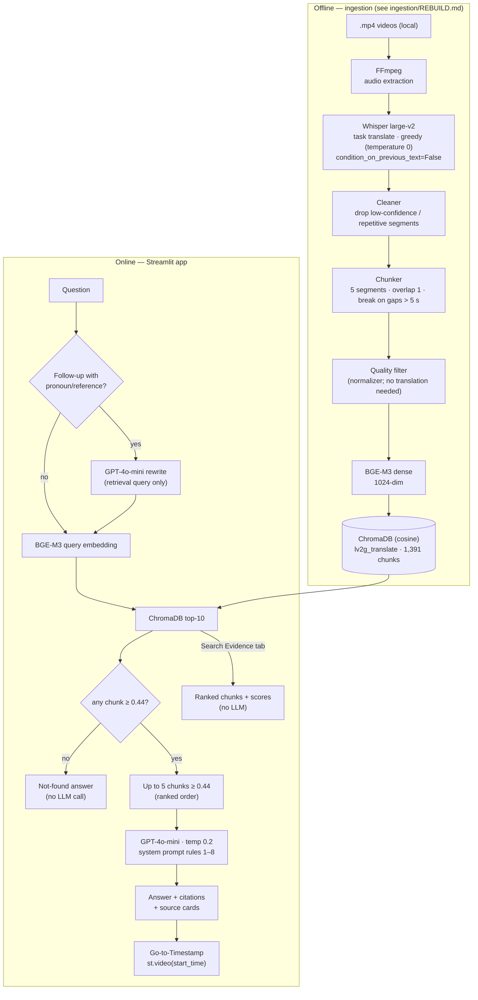

# EduVision RAG — Video Teaching Assistant

> Ask questions about a video course, get answers grounded in the lecture transcripts with
> `[Video @ MM:SS]` citations, inspect the retrieved evidence, and jump to the cited moment in the video.

EduVision is a retrieval-augmented generation (RAG) system over 18 lecture videos (Sigma Web
Development Course, tutorials 1–18: HTML and CSS; the spoken language is Hindi/Hinglish). Whisper
translates the audio into timestamped English transcripts. BGE-M3 embeds the transcript chunks into ChromaDB.
GPT-4o-mini answers only from retrieved evidence and refuses when the evidence does not cover the question.
A Streamlit app has two tabs: **Ask a Question** (RAG answers) and **Search Evidence** (retrieval only, no LLM).

**Status (2026-10-05):** production runs the **Stage 2.6** configuration. It was selected on the DEV split
of a timestamp-anchored benchmark, then evaluated once on the held-out TEST split. The evaluation journey
and full results are in [docs/EVALUATION.md](docs/EVALUATION.md). All benchmark labels and judgements are
AI-produced, not human-verified (see [Known limitations](#known-limitations)).

---

## Features

| Feature | What it does |
|---|---|
| **Video ingestion** | FFmpeg audio extraction → Whisper `large-v2` (task `translate`) → cleaning → 5-segment chunks → BGE-M3 embeddings → ChromaDB. Run offline; the app ships with a pre-built index. |
| **Ask a Question (RAG Q&A)** | Retrieves the top 10 chunks and passes up to 5 that clear the 0.44 similarity threshold to GPT-4o-mini (temperature 0.2). The model answers from that evidence only. |
| **Evidence** | Every answer shows its source cards: transcript text, video, `start → end` time range and similarity score. |
| **Citations** | The model is instructed to cite every fact as `[Video: "<title>" @ MM:SS]`. On DEV, 100% of citations pointed at evidence the model was given (Stage 4 Z1). Not every sentence carries a citation (see limitations). |
| **Go-to-Timestamp** | Each source card has a button that plays the local video from the chunk's `start_time`. Timestamps come from Whisper segment metadata, never from the LLM. The button is hidden when the video file is absent. |
| **Follow-up questions** | A follow-up with a pronoun or reference ("why is *it* important?") is rewritten into a standalone retrieval query by a short GPT call (temperature 0). The generator also receives the prior answer as context. |
| **Abstention** | Two layers. (1) If no retrieved chunk reaches 0.44 similarity, the app refuses **without calling the LLM**. (2) Prompt rule 8 makes the model refuse when the evidence only mentions the topic, or covers a different technique than the one asked about. Both layers produce the same sentence: *"I could not find this topic in the provided course material."* |
| **Search Evidence** | Retrieval-only tab. It ranks transcript chunks with similarity scores, grouped above/below the threshold. No LLM call and no API key are needed. |
| **Video filter** | The sidebar restricts retrieval to a single video. The catalogue is read from index metadata at runtime. |

---

## Architecture


```mermaid
flowchart TB
    subgraph OFFLINE["Offline — ingestion (see ingestion/REBUILD.md)"]
        V[".mp4 videos (local)"] --> FF["FFmpeg<br/>audio extraction"]
        FF --> W["Whisper large-v2<br/>task translate · greedy (temperature 0)<br/>condition_on_previous_text=False"]
        W --> CL["Cleaner<br/>drop low-confidence / repetitive segments"]
        CL --> CH["Chunker<br/>5 segments · overlap 1 · break on gaps > 5 s"]
        CH --> QF["Quality filter<br/>(normalizer; no translation needed)"]
        QF --> EM["BGE-M3 dense<br/>1024-dim"]
        EM --> DB[("ChromaDB (cosine)<br/>lv2g_translate · 1,391 chunks")]
    end

    subgraph ONLINE["Online — Streamlit app"]
        Q["Question"] --> FU{"Follow-up with<br/>pronoun/reference?"}
        FU -->|yes| RW["GPT-4o-mini rewrite<br/>(retrieval query only)"]
        FU -->|no| QE
        RW --> QE["BGE-M3 query embedding"]
        QE --> RT["ChromaDB top-10"]
        RT --> G{"any chunk ≥ 0.44?"}
        G -->|no| NF["Not-found answer<br/>(no LLM call)"]
        G -->|yes| EV["Up to 5 chunks ≥ 0.44<br/>(ranked order)"]
        EV --> GEN["GPT-4o-mini · temp 0.2<br/>system prompt rules 1–8"]
        GEN --> ANS["Answer + citations<br/>+ source cards"]
        ANS --> TS["Go-to-Timestamp<br/>st.video(start_time)"]
        RT -->|Search Evidence tab| SE["Ranked chunks + scores<br/>(no LLM)"]
    end

    DB --> RT
```

### Online data flow (`pipeline.ask`)

1. **Validate** the query (3–500 characters).
2. **Follow-up rewrite** (`pipeline._rewrite_query_for_retrieval`). This step runs only when there is chat
   history and the query matches a pronoun/reference pattern. A GPT-4o-mini call (temperature 0) rewrites the
   query from the last two turns. If the call fails or there is no API key, the original query is used. The
   rewritten text is used **only** for retrieval; the generator receives the original question.
3. **Retrieve** (`retrieval/retriever.py`). The query is embedded with BGE-M3 (fp32). ChromaDB HNSW cosine
   search returns the top 10 chunks, with similarity = 1 − cosine distance. Chunks below the threshold are
   flagged, not dropped.
4. **Gate and select evidence** (`generation/generator.py`). If no chunk is ≥ 0.44, the not-found answer is
   returned without an LLM call. Otherwise the first 5 chunks that clear the threshold, in ranked order,
   become the evidence.
5. **Generate**: GPT-4o-mini, temperature 0.2, `MAX_TOKENS` 1024, `SYSTEM_PROMPT` with rules 1–8. Prior
   context from the conversation is included for follow-ups.
6. **Render** (`app/ui.py`). The app shows the answer, the source cards and the Go-to-Timestamp buttons.
   Transcript text, titles and timestamps are HTML-escaped (`app/text_safety.py`) before they go into custom
   HTML. Users see short, fixed error messages; full error details are only logged on the server.

`app/ui.py` imports only `pipeline`. The pipeline imports retrieval and generation, plus
`ingestion.indexer.get_chroma_client` for the ChromaDB client. Whisper and FlagEmbedding load lazily;
Whisper is never loaded at runtime.

---

## Production configuration (Stage 2.6)

| Component | Setting |
|---|---|
| ASR | Whisper `large-v2`, task `translate`, temperature 0.0, no temperature fallback, `condition_on_previous_text=False`, `fp16=False`, `word_timestamps=False` (segment-level timestamps), language auto-detected |
| Chunking | 5 segments per chunk, 1-segment overlap, hard break on gaps > 5 s |
| Embeddings | BGE-M3 dense (`BAAI/bge-m3`): passages fp16, batch 16, max_length 512; queries fp32 |
| Index | `data/vector_db_lv2g_translate/`, collection `lv2g_translate`, 1,391 chunks, 18 videos, cosine metric |
| Index fingerprint | `2a3b259ded116d30f6aedf8b45b069f1143c52bc1ef8cfbdd9c106725cdf61a7` (byte-identical to the validated Stage 2.6 build) |
| Retrieval | top-k 10, dense only (no hybrid search, no reranking) |
| Threshold | **0.44**: both the no-LLM refusal gate and the per-chunk evidence filter |
| Evidence | up to 5 chunks |
| Generator | GPT-4o-mini, temperature 0.2, max 1024 tokens |
| System prompt | rules 1–7 plus **rule 8** (grounding guard), SHA-256 `9b294ecd05aa9bc350d5056005774e533e1700373fd5b5bd939046fbb133b4e3` |
| Follow-ups | the existing regex-gated rewrite, unchanged |

These values are the code defaults in `config/settings.py` and the module constants in the
chunker/generator. The source of the selection is `experiments/stage2_6_abstention/locked_selection.json`.
An offline check compares the runtime with that file:

```bash
venv/bin/python -m config.consistency   # exit code 1 on any mismatch; does not open ChromaDB or call any API
```

The same check runs in `tests/test_production_config.py`. An environment variable that overrides a
locked value (for example, an old `SIMILARITY_THRESHOLD=0.50`) makes the check fail.

Rule 8, verbatim:

> Before answering, check that the Evidence (or Prior context) actually explains what the question asks.
> If it only mentions the topic, or explains a related but different topic (for example a different tool,
> technique or task than the one asked about), respond with exactly the not-found sentence from rule 3.
> Do not fill gaps with steps, code or facts from general knowledge.

**Rollback.** The previous production index (Whisper `base`, collection `eduvision_chunks_v2`, threshold
0.50) is preserved unchanged in `data/vector_db/`. You can serve it with
`CHROMA_DB_PATH=data/vector_db ACTIVE_COLLECTION=eduvision_chunks_v2 SIMILARITY_THRESHOLD=0.50`. The
consistency check will then report a mismatch, by design.

### Corpus

| | |
|---|---|
| Videos | 18 (Sigma Web Development Course, tutorials 1–18) |
| Spoken language | Hindi/Hinglish (Whisper detects `hi` on all 18). Whisper `translate` produces English text directly, so the GPT normalizer translated 0 chunks. |
| Chunks | 1,395 built, 4 removed by the quality filter, **1,391 indexed**. No `[unclear audio]` chunks. |
| Index size | about 18 MB |

---

## Evaluation summary

All numbers are on **eduvision-bench-v1.1**: 176 queries with gold **timestamp spans**, split into DEV and
TEST. The final configuration was selected on DEV only. TEST was evaluated once, after the selection was
locked. Answers were generated twice per query (2 repeats) and graded by an LLM judge
(`gpt-4.1-2025-04-14`, temperature 0). The judge compared each answer against a reference transcript of the
gold span made by a different Whisper model.

**Locked TEST results: previous production vs. Stage 2.6**

| TEST | Previous production<br/>(Whisper base, 0.50, no rule 8) | **Stage 2.6 (production)** |
|---|---:|---:|
| Recall@10 | 0.711 | **0.899** |
| MRR@10 | 0.677 | **0.785** |
| Correct | 63.0% | **81.5%** |
| Correct or partially correct | 84.8% | **96.2%** |
| Fully grounded (answered) | 73.7% | **85.9%** |
| Hallucination (in-scope answers) | 17.9% | **10.3%** |
| Out-of-scope questions answered | 6.7% | 6.7% |
| False refusals (in-scope) | 15.2% | **3.8%** |
| Citation inside the gold span (±5 s) | 86.5% | 77.4% |

TEST size: 92 scored in-scope queries (184 answers) and 15 out-of-scope queries (30 answers). R@10 gain
+0.188, 95% CI (+0.11, +0.27). Differences of a few points are within noise at this size.

How to read these numbers:

- **"Correct", "grounded" and "hallucination" are judgements by an LLM judge**, measured against
  AI-produced references. They are not human ratings.
- **The citation-in-gold-span rate is lower than before.** This is partly a labelling artefact: about half of
  the gold spans were first drafted from the previous production system's chunk boundaries. On spans placed
  independently of either system, Stage 2.6's timestamp start error is lower (8.4 s vs 16.6 s on TEST).
  See [docs/EVALUATION.md](docs/EVALUATION.md).
- **Out-of-scope answering did not improve over the previous system.** Stage 2.6 brought it back down from
  13.3% (the Stage 2 transcription change alone) to the previous 6.7%: 2 of 30 out-of-scope answers.

**Later stages, no change promoted:**

- **Stage 3** tried hybrid retrieval and reranking (BM25, BGE-M3 sparse, RRF, ColBERT). ColBERT reranking
  improved retrieval (DEV R@10 0.900 → 0.947), but hallucination roughly doubled (≈13% → 26%). No variant
  improved end-to-end answers.
- **Stage 4** studied citation integrity and claim-level faithfulness, offline. Every citation was valid,
  but about 42% of factual sentences carried no citation. Claim-level faithfulness could not be measured
  reliably with the existing judge or the embedding proxy.

The full evaluation history, metric definitions, DEV results and artifact index are in
[docs/EVALUATION.md](docs/EVALUATION.md).

---

## Known limitations

- **Benchmark labels are AI-checked, not human-verified.** An AI annotator wrote the queries and gold spans
  and checked them against two Whisper transcriptions and video frames. The answer judge is also an LLM, and
  its reference text is a Whisper transcript. No person has verified the labels.
- **Claim-level faithfulness is unresolved (Stage 4).** The existing judge and the BGE-M3 alignment proxy
  were not reliable at claim level on a small, AI-labelled verification set. No faithfulness metric or
  intervention was adopted.
- **Citation coverage is incomplete.** About 42% of factual sentences in DEV answers carry no citation
  (heuristic count). Citations are free text written by the model; they are not parsed or validated at
  runtime.
- **No global rate or budget limit.** The only limit is a 10-question counter per browser session, which
  resets on page reload. A public deployment spends the owner's OpenAI key without a global cap.
- **BGE-M3 memory and cold start need validation on the deployment host.** The model is about 2.2 GB of
  weights, is downloaded from Hugging Face on first start and runs queries in fp32.
- **Videos are local project data.** `videos/` is git-ignored and not redistributable. Without it,
  Go-to-Timestamp buttons are hidden; retrieval, answers and evidence still work.
- **ChromaDB writes to its directory when opened.** The index directory must be writable, and running the app
  can change files in `data/vector_db_lv2g_translate/`. To verify the fingerprint, check a copy.
- **A rebuild may not reproduce the shipped index.** Whisper output can differ across hardware and library
  versions. The shipped index is the reference artifact.
- **Partial answers can be hidden.** Any answer containing "could not find" is treated as not-found, and the UI
  shows the not-found box instead. The metrics were measured with this behaviour, so it was left unchanged.
- **Small evaluation slices.** TEST has 12 Hinglish and 9 follow-up in-scope queries, so slice results are
  indicative only.
- **Python version.** The pinned dependencies were verified only on Python 3.14.2.
- **External dependency.** Answers and follow-up rewriting require the OpenAI API. Search Evidence does not.

---

## Quick start

### Prerequisites

- Python 3.14 (the pinned versions were verified on 3.14.2)
- Network access on first start: the BGE-M3 weights (about 2.2 GB) download from Hugging Face
- FFmpeg, **only** for rebuilding the index (`brew install ffmpeg` / `sudo apt install ffmpeg`)

### Run the app

```bash
python3 -m venv venv
source venv/bin/activate
pip install -r app/requirements.txt     # runtime only; use requirements.txt for ingestion + evaluation
```

Create `.env` in the project root (it is git-ignored):

```env
OPENAI_API_KEY=sk-...   # required for answers and follow-up rewriting; Search Evidence works without it
```

No other variables are needed: the defaults are the Stage 2.6 configuration. Do not copy an old `.env`
that sets `WHISPER_MODEL=base`, `SIMILARITY_THRESHOLD=0.50`, `CHROMA_DB_PATH=data/vector_db` or
`ACTIVE_COLLECTION=eduvision_chunks_v2`, because those values silently restore the previous system.

```bash
venv/bin/python -m config.consistency   # expect "RESULT: OK"
streamlit run app/ui.py                 # http://localhost:8501
```

Put the course `.mp4` files in `videos/` to enable Go-to-Timestamp. The filenames must match the
`video_filename` values in the index metadata.

### Configuration

Settings are read from environment variables (or `.env`) in `config/settings.py`. The defaults are the
Stage 2.6 values.

| Variable | Default | Notes |
|---|---|---|
| `OPENAI_API_KEY` | — | Required for answers and follow-up rewriting |
| `OPENAI_MODEL` | `gpt-4o-mini` | Generator and rewrite model |
| `TEMPERATURE` | `0.2` | Generator temperature |
| `MAX_TOKENS` | `1024` | Generator response limit |
| `BGE_MODEL` | `BAAI/bge-m3` | Embedding model |
| `CHROMA_DB_PATH` | `data/vector_db_lv2g_translate` | Relative paths resolve against the project root |
| `ACTIVE_COLLECTION` | `lv2g_translate` | ChromaDB collection |
| `RETRIEVAL_TOP_K` | `10` | Chunks retrieved per query |
| `MAX_LLM_EVIDENCE` | `5` | Maximum evidence chunks passed to the LLM |
| `SIMILARITY_THRESHOLD` | `0.44` | Refusal gate and evidence filter |
| `WHISPER_MODEL` | `large-v2` | Ingestion only |
| `WHISPER_TASK` | `translate` | Ingestion only |
| `WHISPER_TEMPERATURE` | `0.0` | Ingestion only |
| `WHISPER_TEMPERATURE_FALLBACK` | `false` | Ingestion only |
| `WHISPER_CONDITION_ON_PREVIOUS_TEXT` | `false` | Ingestion only |

Chunking (5 / 1 / 5 s) and the system prompt are code constants, not environment variables. Changing any
locked value makes `python -m config.consistency` fail.

---

## Rebuilding the index

**Do not rebuild the production index in place.** Follow [ingestion/REBUILD.md](ingestion/REBUILD.md).
In short:

- The authoritative build path is `experiments/stage2_transcription/build_candidate.py`
  (`transcribe --model large-v2 --task translate --greedy`, then `index`). It always uses a **new** name and
  writes under `experiments/stage2_transcription/artifacts/<name>/`.
- `ingestion/build_safety.py` refuses to build into the shipped index, the legacy `data/vector_db/`, the
  validated Stage 2.6 source or whatever `CHROMA_DB_PATH` points to. It also refuses to reuse stale cached
  transcripts, chunks or embeddings unless forced.
- `ingestion/indexer_v2.py` (the legacy staged pipeline) needs an explicit
  `--db-path <non-production dir> --collection <name>`.
- Before promotion, verify the rebuilt index: its fingerprint (on a copy), its chunk count and its DEV
  retrieval results. Promotion is a separate, explicit decision. Update `config/settings.py` and
  `config/consistency.py` together when promoting.

---

## Testing and evaluation tools

```bash
venv/bin/python -m unittest discover -s tests   # offline unit tests: no API calls, does not open the production index
venv/bin/python -m config.consistency           # offline production-config check
```

| Tool | Cost | Notes |
|---|---|---|
| `tests/` | free | Production config, rebuild safety, UI text safety, benchmark metrics and the Stage 3/4 experiment code |
| `eval/run_benchmark.py` | free (local BGE-M3) | Retrieval metrics for both DEV and TEST. Opens ChromaDB (rewrites index files). **TEST is held out; do not tune on it.** |
| `eval/compare_results.py` | free | Paired comparison of two result files with bootstrap CIs |
| `eval/bench_tools.py` | free | Annotation and validation CLI for the benchmark |
| `eval/answer_eval.py` | **paid** (OpenAI) | End-to-end answers plus the LLM judge |
| `eval/evaluate.py`, `eval/eval_followup.py` | **paid** (OpenAI) | Legacy 17-case and 5-case smoke suites. They passed (17/17, 5/5) on the **previous** system and have not been re-run on Stage 2.6. |

---

## Project structure

```text
├── app/
│   ├── ui.py                    Streamlit app (Ask a Question, Search Evidence, video player)
│   ├── text_safety.py           HTML escaping / safe error text for the UI
│   ├── requirements.txt         runtime dependencies
│   └── .streamlit/config.toml
├── config/
│   ├── settings.py              all runtime settings (Stage 2.6 defaults)
│   └── consistency.py           offline check: runtime == locked Stage 2.6 selection
├── pipeline.py                  ask() / search() / health_check(): the UI's only entry point
├── retrieval/retriever.py       BGE-M3 query embedding + ChromaDB search
├── generation/generator.py      evidence selection, SYSTEM_PROMPT (rules 1–8), GPT-4o-mini call
├── ingestion/                   offline: video_processor, transcriber, cleaner, chunker,
│                                normalizer, embedder, indexer(_v2), build_safety, REBUILD.md
├── data/
│   ├── vector_db_lv2g_translate/   PRODUCTION index (Stage 2.6)
│   └── vector_db/                  previous production index (rollback only)
├── eval/
│   ├── benchmark/               eduvision-bench-v1.1 (176 queries) + corpus manifest + README
│   ├── results/                 per-run result files of Stages 1–3
│   ├── run_benchmark.py, bench_*.py, compare_results.py, answer_eval.py
│   └── evaluate.py, eval_followup.py   legacy smoke suites
├── experiments/                 EXPERIMENT HISTORY: not used by the app
│   ├── stage2_transcription/    Stage 2 / 2.5 (ASR A/B, chunking) + authoritative index build script
│   ├── stage2_6_abstention/     locked_selection.json, guard_prompt.txt (rule 8), threshold sweep
│   ├── stage3_retrieval/        hybrid retrieval / reranking (negative result)
│   ├── stage4_faithfulness/     citation integrity + faithfulness (offline, nothing promoted)
│   └── finalization/            pre-finalization audit (2026-10-05)
├── tests/                       offline unit tests
├── docs/EVALUATION.md           evaluation journey and final metrics
├── archive/                     one-off script used for the previous index (historical)
└── requirements.txt             full dependencies (ingestion + evaluation)
```

### Production vs. experiment history

- **Production:** `app/`, `config/`, `pipeline.py`, `retrieval/`, `generation/`, `ingestion/` and
  `data/vector_db_lv2g_translate/`. These run in the app or build its index.
- **Rollback only:** `data/vector_db/`.
- **Evaluation harness:** `eval/` and `tests/`. Not imported by the app.
- **Experiment history:** `experiments/stage*/`, `eval/results/`, `experiments/finalization/` and `archive/`.
  These are kept as the record of how the configuration was chosen. Paths and statements in them describe
  the system at the time each stage ran: for example, Stage 3/4 reports refer to the index under
  `experiments/stage2_transcription/artifacts/`, which is now shipped as `data/vector_db_lv2g_translate/`.
